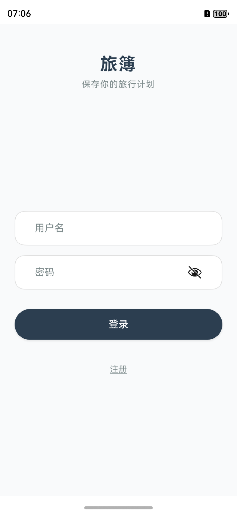
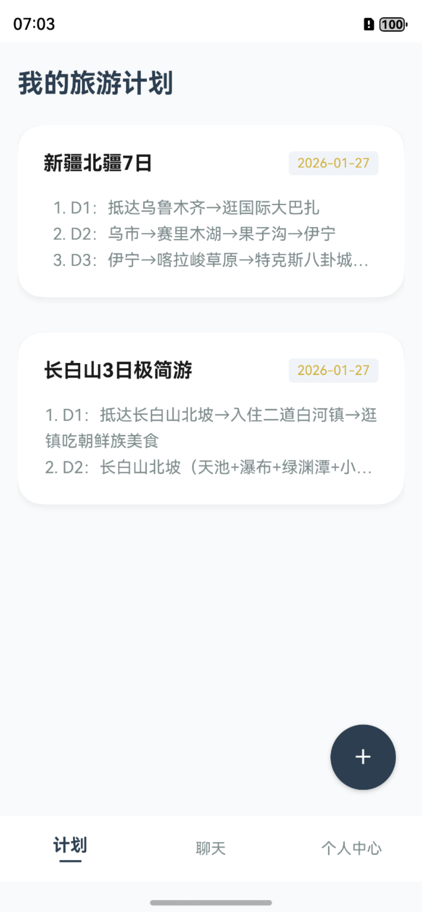
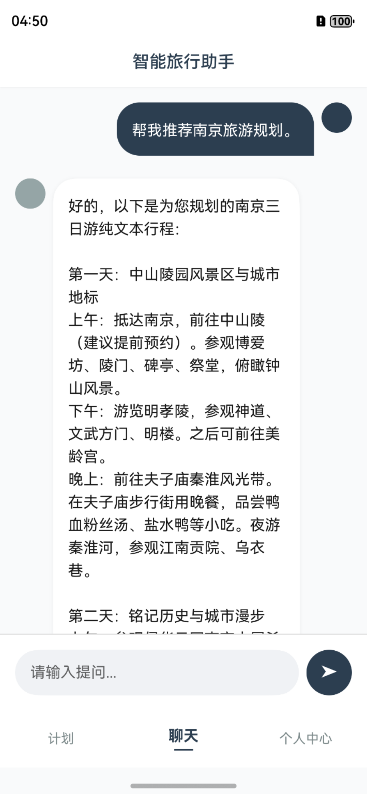
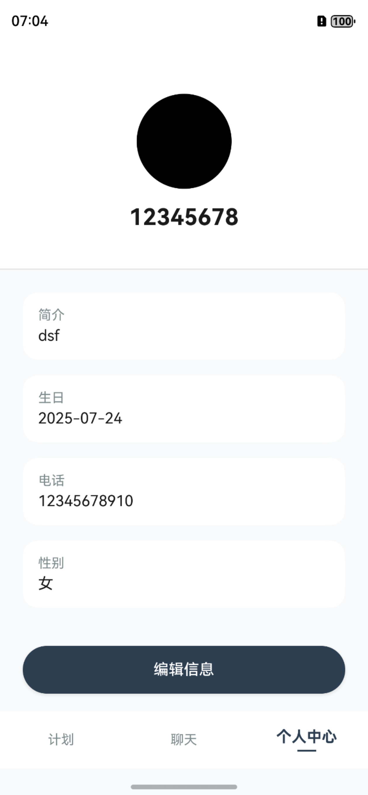

## MYTravelPlan（我的旅行计划）

基于鸿蒙的旅游计划应用。结合了本地数据库存储和 AI 智能对话功能，帮助用户轻松制定和管理旅游行程。

## 应用截图

  
  
  
  

## 技术栈

*   **开发语言**: ArkTS (TypeScript)
*   **UI 框架**: ArkUI
*   **构建工具**: Hvigor
*   **数据库**: RelationalStore (RDB)
*   **网络通信**: @ohos.net.http
*   **AI 服务**: DeepSeek API

## 环境要求

*   DevEco Studio
*   HarmonyOS SDK (API 13+)

## 注意事项

*   **API Key**: 项目目前在 `DeepSeekService.ets` 中使用了硬编码的 API Key。在实际部署或公开代码前，请确保替换为您自己的 Key，并建议将其移至配置文件或环境变量中以保证安全。
*   **网络权限**: 应用需要联网权限 (`ohos.permission.INTERNET`) 才能访问 AI 服务。
